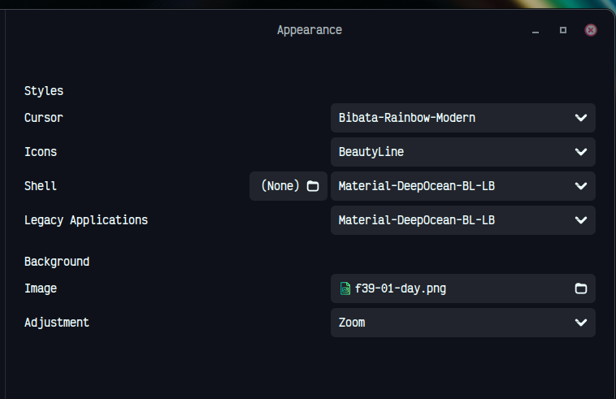

# Theme

Material GTK Themes: https://github.com/Fausto-Korpsvart/Material-GTK-Themes

`@vscode`

```bash
code --install-extension Equinusocio.vsc-material-theme
```

`@Google Chrome`

https://chromewebstore.google.com/detail/material-deep-ocean/nfbndjdhaehagagfllfcddofghkhcfdf

`@Firefox`

https://addons.mozilla.org/en-US/firefox/addon/material-deep-ocean-theme/

# Icons

BeautyLine: https://www.gnome-look.org/p/1425426/

# Cursors

Bibata Rainbow Modern: https://www.gnome-look.org/p/1445634
Bibata Rainbow Modern Github: https://github.com/ful1e5/Bibata_Cursor_Rainbow

# gnome-tweaks configurations

